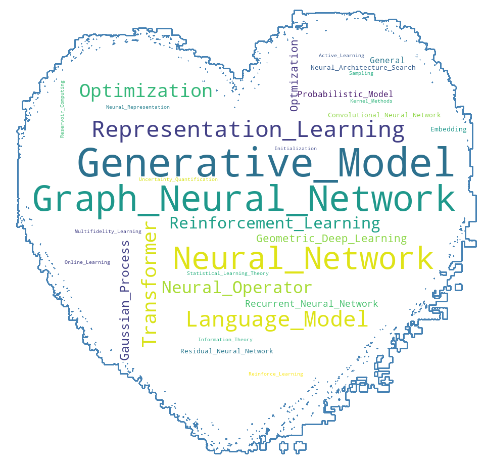
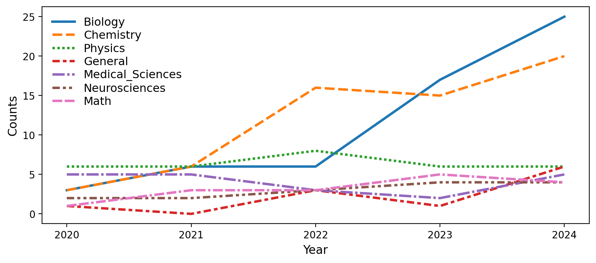
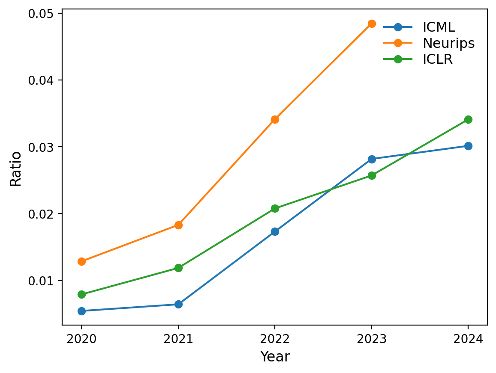



* [AI for Science Paper Collection and analysis](https://github.com/Zixuan-Wang1215/AI_for_Science_paper_collection) from top ICML, NeurIPS, ICLR: Collecting and labeling the papers from top conferenes and conduct further analysis.

* [3D Virtual Rubik's Cube](https://github.com/Zixuan-Wang1215/3D-Virtual-Rubiks-Cube): A virtual Rubik's Cube powered by Unity engine.

* [Bilibili dataset](https://github.com/Zixuan-Wang1215/Bilibili_Dataset): A free open source dataset collecting top 100 videos' details from bilibili.com, a Chinese video platform.

* [Deep-Learning-Application-in-Protein-Structure-Understanding](https://github.com/Zixuan-Wang1215/Deep-Learning-Application-in-Protein-Structure-Understanding): Discovering how deep learning can be implicated in the field of protein structure.